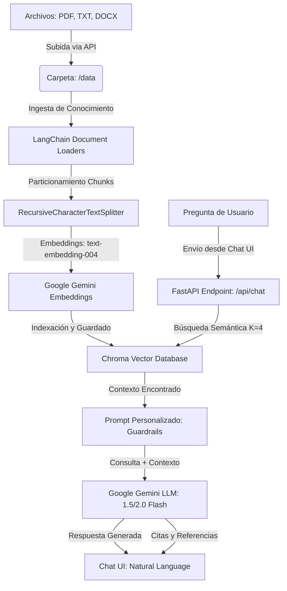

# DocuMind - Asistente de Documentos RAG Inteligente

DocuMind es una aplicación web funcional de **RAG (Retrieval-Augmented Generation)** que permite cargar archivos de texto, PDF o Word para construir una base de conocimientos local y consultarla utilizando lenguaje natural. La aplicación utiliza un backend en **Python** con **FastAPI** y **LangChain**, una base de datos vectorial local con **Chroma**, y un frontend responsivo y premium de estilo *glassmorphic* oscuro (HTML/CSS/JS).

---

## 🏗️ Arquitectura del Sistema

El flujo de procesamiento de la aplicación sigue la arquitectura clásica de RAG:



1. **Carga y Particionado**: Los archivos subidos se leen dinámicamente según su formato (`PyPDFLoader` para PDF, `Docx2txtLoader` para Word, `TextLoader` para TXT). Se dividen en fragmentos lógicos de 1000 caracteres con un traslape de 200 caracteres para conservar el contexto.
2. **Base Vectorial**: Los fragmentos se convierten a vectores numéricos de alta dimensionalidad utilizando el modelo `text-embedding-004` de Google Gemini y se persisten localmente en una base de datos **Chroma DB** en el directorio `./vector_db`.
3. **Generación con Guardrails**: Al consultar, se recuperan los 4 fragmentos más relevantes. El prompt del sistema restringe estrictamente al LLM (por defecto `gemini-1.5-flash`) a responder **únicamente** con la información de los fragmentos, respondiendo con un mensaje controlado de seguridad si el tema consultado no está en el documento.

---

## 🛠️ Guía de Instalación y Configuración

### 1. Instalar Python en Windows (Paso Obligatorio)

Como Python no se encuentra configurado actualmente en tu sistema, puedes instalarlo de las siguientes maneras:

#### Opción A: Usando winget (La más rápida por consola)
Abre una terminal de **PowerShell** como Administrador y ejecuta:
```powershell
winget install Python.Python.3.11
```
*(Reinicia la terminal de comandos después de la instalación para que se actualicen las variables de entorno).*

#### Opción B: Descarga Manual
1. Ve al sitio oficial: [python.org/downloads](https://www.python.org/downloads/) y descarga **Python 3.11** o **3.10**.
2. **CRÍTICO**: Al abrir el instalador, marca la casilla **"Add python.exe to PATH"** en la parte inferior de la ventana inicial. Si no marcas esto, el sistema no reconocerá el comando `python`.
3. Haz clic en **Install Now**.

---

### 2. Preparar el Entorno del Proyecto

Una vez que tengas Python instalado y la consola reiniciada:

1. Abre tu terminal de comandos (PowerShell o CMD) en la carpeta del proyecto:
   ```powershell
   cd c:\Users\eduar\Documents\GitHub\Challenge_alluraOracle_IA
   ```

2. Crea un entorno virtual para aislar las dependencias:
   ```powershell
   python -m venv .venv
   ```

3. Activa el entorno virtual:
   - En **PowerShell**:
     ```powershell
     .venv\Scripts\Activate.ps1
     ```
     *(Si da error de permisos en PowerShell, puedes ejecutar previamente `Set-ExecutionPolicy -ExecutionPolicy RemoteSigned -Scope Process`)*
   - En **CMD (Símbolo del Sistema)**:
     ```cmd
     .venv\Scripts\activate.bat
     ```

4. Instala todas las dependencias requeridas:
   ```powershell
   pip install -r requirements.txt
   ```

---

### 3. Configuración de API Key

Tienes dos opciones para proporcionar la API Key de Google Gemini:

- **Opción A (Recomendada para producción local)**: Copia el archivo `.env.example` y renómbralo a `.env`. Pega tu clave de API:
  ```env
  GEMINI_API_KEY=AIzaSy...
  ```
- **Opción B (Dinámica en caliente)**: Pega la API Key directamente en el panel de **Configuración** de la interfaz web. Se guardará de manera segura solo durante tu sesión de navegación.

*¿No tienes una API Key? Puedes crear una de forma gratuita en [Google AI Studio](https://aistudio.google.com/).*

---

## 🚀 Ejecución del Servidor

Con el entorno virtual activado, inicia el servidor backend ejecutando:

```powershell
python main.py
```

El servidor se iniciará en `http://localhost:8000`.

---

## 🧪 Guía de Prueba de la Aplicación

Hemos incluido archivos de ejemplo dentro de la carpeta `sample_docs/` para que pruebes el funcionamiento del sistema inmediatamente:
- `politicas_empresa.txt`: Contiene directrices de la empresa ficticia *TechNova Solutions* (horarios flexibles, modelo híbrido, código de vestimenta).
- `preguntas_frecuentes.txt`: Contiene preguntas y respuestas de TI (contraseñas, Wi-Fi de invitados, cómo reservar salas de reuniones).

### Flujo de Prueba Paso a Paso:

1. Abre tu navegador e ingresa a: **`http://localhost:8000`**
2. Introduce tu **Gemini API Key** en la barra lateral de configuración.
3. Haz clic en **Explorar Archivos** (o arrastra y suelta) en la zona de carga de archivos.
4. Selecciona los dos archivos que están en `sample_docs/` (`politicas_empresa.txt` y `preguntas_frecuentes.txt`). Verás cómo se añaden a la lista de espera con un estado pendiente.
5. Haz clic en **Ingestar Archivos**. Esto enviará los archivos al backend, donde LangChain los segmentará, generará los embeddings vectoriales con Gemini y los guardará en la base de datos Chroma local. Verás que el estado de archivos indexados sube a `2`.
6. **¡Listo!** Ahora puedes chatear:
   - Haz clic en las sugerencias rápidas (ej. *¿Cómo es la política híbrida?* o *¿Cómo reservo salas de reunión?*).
   - Verás la respuesta formulada en lenguaje natural.
   - En la parte inferior de cada respuesta de la IA, haz clic en **"Ver fuentes y referencias"** para ver exactamente de qué archivo y qué fragmento de texto extrajo la respuesta el sistema.
7. Haz pruebas de robustez: Pregúntale cosas no incluidas en el documento (ej. *"¿Cuál es la capital de Francia?"* o *"¿Cómo cocino una lasaña?"*). Verás que responde: *"No tengo información suficiente en los documentos cargados para responder a esa pregunta."*, lo cual confirma que los límites de seguridad funcionan correctamente.