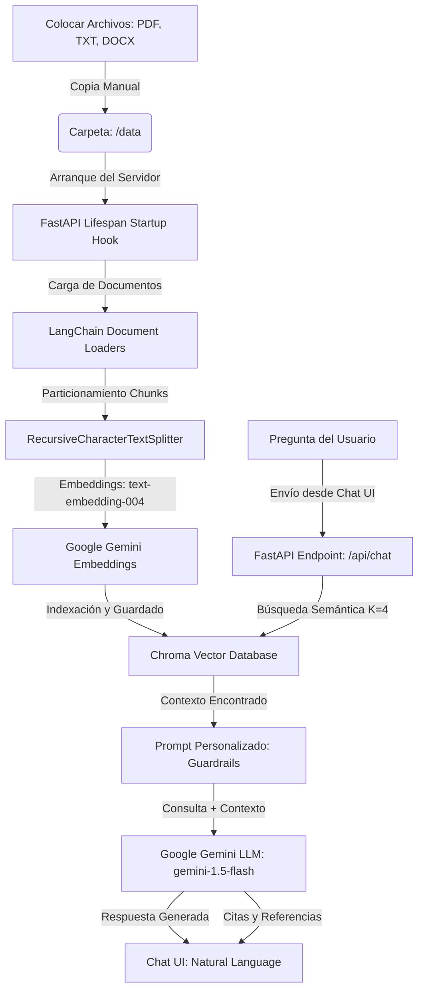

# DocuMind - Asistente de Documentos RAG Inteligente

DocuMind es una aplicación web funcional de **RAG (Retrieval-Augmented Generation)** que permite interactuar mediante lenguaje natural con archivos de texto, PDF o Word. 

Esta versión cuenta con una **interfaz minimalista e inmersiva de chat (estilo oscuro glassmorphic)** y automatización completa en el backend: el conocimiento se procesa automáticamente al arrancar el servidor a partir de los documentos depositados en la carpeta de datos.

---

## 🏗️ Arquitectura del Sistema

El flujo de procesamiento y consulta sigue la arquitectura clásica de RAG de forma automatizada:



1. **Ingesta Automática al Inicio**: Al iniciar el servidor web, el hook de ciclo de vida (`lifespan`) detecta los documentos en la carpeta `./data` y ejecuta el pipeline de LangChain de forma transparente.
2. **Carga y Particionado**: Los archivos se leen dinámicamente según su formato (`PyPDFLoader`, `Docx2txtLoader` o `TextLoader`). Se dividen en fragmentos de 1000 caracteres con un traslape de 200 caracteres para conservar el contexto semántico.
3. **Base de Datos Vectorial**: Los fragmentos se convierten a vectores utilizando el modelo oficial `text-embedding-004` de Google Gemini y se persisten en una base **Chroma DB** local (`./vector_db`).
4. **Generación Controlada (Guardrails)**: Al consultar en el chat, se recuperan los 4 fragmentos más relevantes. El prompt restringe estrictamente al LLM (`gemini-1.5-flash`) a responder **únicamente** con la información de los fragmentos, evitando alucinaciones o uso de conocimiento externo.

---

## 🛠️ Guía de Instalación y Configuración

### 1. Requisitos Previos

- **Python 3.10 o 3.11** instalado en tu sistema.
- Una clave de API de Gemini. Puedes obtenerla gratis en [Google AI Studio](https://aistudio.google.com/).

### 2. Configurar Variables de Entorno

Copia el archivo `.env.example` en un nuevo archivo llamado `.env` y pega tu clave API de Gemini:

```env
# Configuración del Servidor DocuMind RAG
GEMINI_API_KEY=tu_clave_api_aqui
```

El archivo `.env` ya se encuentra configurado en el `.gitignore` del proyecto para evitar subirlo a Git por accidente.

---

## 🚀 Opciones de Ejecución

### Opción A: Ejecución Local (Python)

1. Abre tu terminal en la carpeta del proyecto y crea un entorno virtual:
   ```powershell
   python -m venv .venv
   ```
2. Activa el entorno virtual:
   - **En Windows (PowerShell)**:
     ```powershell
     .venv\Scripts\Activate.ps1
     ```
   - **En Windows (CMD)**:
     ```cmd
     .venv\Scripts\activate.bat
     ```
   - **En macOS/Linux**:
     ```bash
     source .venv/bin/activate
     ```
3. Instala las dependencias necesarias:
   ```bash
   pip install -r requirements.txt
   ```
4. Inicia el servidor:
   ```bash
   python main.py
   ```
5. Accede a la aplicación en tu navegador web en: **`http://localhost:8000`**

---

### Opción B: Ejecución en Contenedor (Docker)

El proyecto viene completamente empaquetado para Docker. Los directorios `./data` y `./vector_db` se montan como volúmenes para que puedas gestionar tus archivos y la base vectorial de manera persistente desde tu máquina host.

1. Asegúrate de tener Docker y Docker Compose instalados.
2. Inicia los contenedores construyendo la imagen:
   ```bash
   docker-compose up --build
   ```
3. Accede al chat en: **`http://localhost:8000`**

---

## 🧪 Cómo Probar el Chat RAG

1. Coloca tus archivos de conocimiento (en formato `.pdf`, `.txt` o `.docx`) dentro de la carpeta `./data/`. (El proyecto incluye archivos de ejemplo como `politicas_empresa.txt` y `preguntas_frecuentes.txt` en la carpeta `sample_docs/`).
2. Inicia o reinicia el servidor web (el backend procesará e indexará automáticamente cualquier archivo nuevo que encuentre en la carpeta de datos).
3. Entra a **`http://localhost:8000`** en tu navegador.
4. Escribe tus preguntas en la barra de chat.
5. Puedes hacer clic en **"Ver fuentes y referencias"** debajo de las respuestas del asistente para desplegar los fragmentos de texto exactos y el nombre del archivo de donde provienen los datos.
6. **Validación de Seguridad**: Si intentas preguntarle algo fuera del contexto del conocimiento proporcionado (ej. *"¿Cómo cocino una lasaña?"*), el sistema responderá controladamente: *"No tengo información suficiente en los documentos cargados para responder a esa pregunta."*